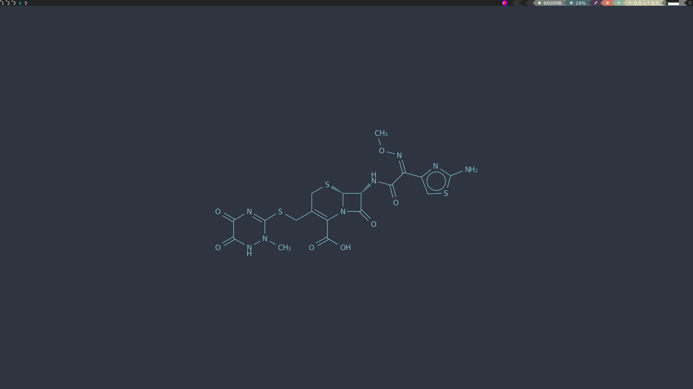

<div id="top"></div>

<!-- HEADER -->
<br />
<div align="center">
    

  <h2 align="center">My AwesomeWM Dotfiles on Fedora</h2>

  <p align="center">
    List of everything I do on a Fedora 35 installation.
    <br />
    <br />
  </p>
</div>

<!-- ABOUT -->
## About



This repo is to serve as a backup to myself (or anyone interested) of my configurations for Fedora Linux, which I use as my daily driver. 

### Built With

* [Fedora](https://getfedora.org/)
* [Stow](https://www.gnu.org/software/stow/)
* [AwesomeWM](https://awesomewm.org/)
* [Awesome Copycats](https://github.com/lcpz/awesome-copycats)
* [Rofi](https://wiki.archlinux.org/title/Rofi)
* [Bash](https://www.gnu.org/software/bash/)
* [Lua](https://www.lua.org/)

<!-- GETTING STARTED -->
## Getting Started

### Prerequisites

The script is intended to run on a fresh Fedora Linux (34 or 35) installation. You can get that here: [getfedora.org](https://getfedora.org/)

### Installation

1. Clone the repo

2. (OPTIONAL) Add yourself to sudoers

```bash
sudo nano /etc/sudoers
```
Uncomment: `%wheel ALL=(ALL) NOPASSWD: ALL`

Then, at end of file, for your username add: `yourusername ALL=(ALL) NOPASSWD: ALL`

3. (OPTIONAL) I have a laptop, so I like to enable a clamshell like mode:

```bash
sudo nano /etc/systemd/logind.conf
```

Modify the following lines: 

`HandleLidSwitch=ignore`

`HandleLidSwitchExternalPower=ignore`

`HandleLidSwitchDocked=ignore`

`IdleAction=ignore`

4. (OPTIONAL) DNF Config

[dnf.conf manual](https://man7.org/linux/man-pages/man5/dnf.conf.5.html)

```bash
sudo nano /etc/dnf/dnf.conf
```

Add the following lines:

`fastestmirror=True`

`max_parallel_downloads=20`

`defaultyes=True`

5. Auto deploy

The `install.sh` script will take care of updating the system and installing programs. 

```bash
cd stow
```

```bash
chmod +x install.sh
```

```bash
./install.sh
```

6. Configure NVIDIA

**NVIDIA X Server Settings > X Server Display Configuration > Advanced > "Force Full Composition Pipeline", Save to X Configuration File**

[Fedora 35 Nvidia - Reddit](https://www.reddit.com/r/Fedora/comments/r3159m/nvidia_driver_is_not_working_after_a_fedora_34_to/)

7. Install desired themes, other software, and reboot.

<!-- USAGE EXAMPLES -->
## Usage

All of the keybinds are specified under .config/awesome/rc.lua. Some keybinds that launch bash scripts will be missing due to my own privacy concerns, however, feel free to replace them with your own customizations. I may update this section later to detail out the most common shortcuts.

<!-- CONTRIBUTING -->
## Contributing

Any contributions you make are **greatly appreciated**.

If you have a suggestion that would make this better, please fork the repo and create a pull request.

1. Fork the Project
2. Create your Feature Branch (`git checkout -b feature/MyGreatFeatureRequest`)
3. Commit your Changes (`git commit -m 'Add some features'`)
4. Push to the Branch (`git push origin feature/MyGreatFeatureRequest`)
5. Open a Pull Request

<!-- LICENSE -->
## License

Distributed under the GPLv3 License. See `LICENSE` for more information.

<p align="right">(<a href="#top">back to top</a>)</p>
