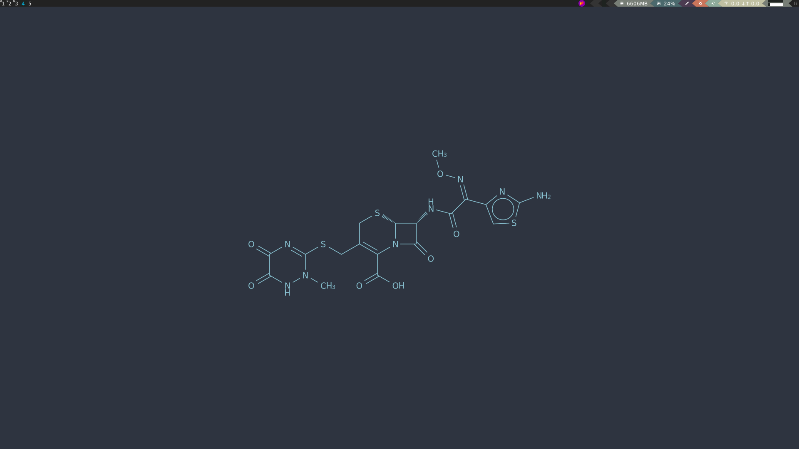

<div id="top"></div>

<!-- HEADER -->
<br />
<div align="center">
    

  <h2 align="center">My Fedora Linux Dotfiles</h2>

  <p align="center">
    List of everything I do on a fresh Fedora Linux installation.
    <br />
    <br />
  </p>
</div>

<!-- ABOUT -->
## About



This repo is to serve as a backup to myself (or anyone interested) of my configurations for Fedora Linux, which I use as my daily driver. 

### Built With

* [Fedora](https://getfedora.org/)
* [Stow](https://www.gnu.org/software/stow/)
* [AwesomeWM](https://awesomewm.org/)
* [Awesome Copycats](https://github.com/lcpz/awesome-copycats)
* [Rofi](https://wiki.archlinux.org/title/Rofi)
* [Nord Rofi](https://github.com/amayer5125/nord-rofi)
* Bash
* Lua
* And the other various programs I use

<!-- GETTING STARTED -->
## Getting Started

### Prerequisites

The script and instructions are intended to run on a fresh Fedora Linux installation. You can get that here: [getfedora.org](https://getfedora.org/)

### Installation

1. Clone the repo
2. (OPTIONAL) Add yourself to sudoers

```bash
sudo nano /etc/sudoers
```
- Uncomment: %wheel ALL=(ALL) NOPASSWD: ALL
- Then, at end of file, for your username add: 

yourusername ALL=(ALL) NOPASSWD: ALL

3. (OPTIONAL) I have a laptop, so I like to enable a clamshell like mode:

```bash
sudo nano /etc/systemd/logind.conf
```
Modify the following line:

HandleLidSwitch=Ignore

4. (OPTIONAL) DNF Config

```bash
sudo nano /etc/dnf/dnf.conf
```

Modify / Add the following lines:

fastestmirror=True
max_parallel_downloads=10
defaultyes=True

5. Auto deploy

The `install.sh` script will take care of updating the system and installing programs. 

```bash
cd stow
```

```bash
chmod +x install.sh
```

```bash
./install.sh
```

You could instead follow the manual steps listed at the bottom.

6. Configure NVIDIA

**NVIDIA X Server Settings > X Server Display Configuration > Advanced > "Force Full Composition Pipeline", Save to X Configuration File**

7. AppImages, RPM, NPM

### RPM / NPM

- [taskbook](https://github.com/klaussinani/taskbook)

- [ungoogled-chromium](https://github.com/ungoogled-software/ungoogled-chromium-fedora)

- [Codium](vscodium.com)


### AppImages

- [Bitwarden](https://bitwarden.com)

- [LibreWolf](https://librewolf.net)

- [MarkText](https://github.com/marktext/marktext)

- [ONLYOFFICE](https://www.onlyoffice.com/)

- [Pomotroid](https://github.com/Splode/pomotroid)

- [Pycharm](https://www.jetbrains.com/pycharm/)

- [Monero GUI Waller](https://github.com/monero-project/monero-gui)

- [Coinomi Eth Wallet](https://www.coinomi.com/en/#)

### Theme

- [Nord](https://github.com/EliverLara/Nordic)


## Manual Installation

1. Update

```bash
sudo dnf update -y
```

2. Enable RPM & Multimedia Codecs

[RPM](https://docs.fedoraproject.org/en-US/quick-docs/setup_rpmfusion/)

```bash
sudo dnf install -y \
  https://download1.rpmfusion.org/free/fedora/rpmfusion-free-release-$(rpm -E %fedora).noarch.rpm
```

```bash
sudo dnf install -y \
  https://download1.rpmfusion.org/nonfree/fedora/rpmfusion-nonfree-release-$(rpm -E %fedora).noarch.rpm
```

[Codecs](https://docs.fedoraproject.org/en-US/quick-docs/assembly_installing-plugins-for-playing-movies-and-music/)

```bash
sudo dnf install -y gstreamer1-plugins-{bad-\*,good-\*,base} gstreamer1-plugin-openh264 gstreamer1-libav --exclude=gstreamer1-plugins-bad-free-devel
```

```bash
sudo dnf install -y lame\* --exclude=lame-devel
```

```bash
sudo dnf group upgrade -y --with-optional Multimedia
```

3. Install Packages

```
sudo dnf install -y awesome electrum elementary-icon-theme feh flameshot gimp hugo lxappearance mpv npm neofetch newsboat nitrogen ranger rofi stow transmission vim arandr xrandr nvidia-settings                
```

4. Symbolically link dotfiles

```
cd stow
stow .
```

<!-- USAGE EXAMPLES -->
## Usage

All of the keybinds are specified under .config/awesome/rc.lua. Some keybinds that launch bash scripts may be missing due to my own privacy concerns. I may update this section later to detail out the most common shortcuts.

<!-- CONTRIBUTING -->
## Contributing

Any contributions you make are **greatly appreciated**.

If you have a suggestion that would make this better, please fork the repo and create a pull request.

1. Fork the Project
2. Create your Feature Branch (`git checkout -b feature/MyGreatFeatureRequest`)
3. Commit your Changes (`git commit -m 'Add some features'`)
4. Push to the Branch (`git push origin feature/MyGreatFeatureRequest`)
5. Open a Pull Request

<!-- LICENSE -->
## License

Distributed under the GPLv3 License. See `LICENSE` for more information.

<p align="right">(<a href="#top">back to top</a>)</p>